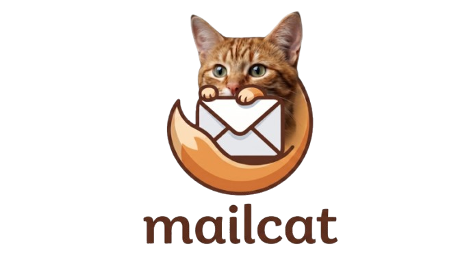

<div align="center">
  
  <h1>extension 🐱 </h1>
  <p><em>The easiest way to catch, preview, and test emails directly in VS Code.</em></p>
</div>

## 🐱 What is MailCat?
**MailCat** is a lightweight, local SMTP server right inside your VS Code. It intercepts all outgoing emails from your development environment and displays them in a beautifully designed Inbox inside your editor. 

Stop cluttering your real email inbox, and stop paying for external SMTP testing services. MailCat catches everything locally!

##  Features
- **Zero Config Setup**: Works out of the box on port `2525`.
- **Universal Compatibility**: Works with **ANY** language or framework (Node.js, PHP, Python, Java, C#, Go, etc).
- **Live HTML Preview**: View exactly how your email will render on desktop and mobile.
- **CSS & Compatibility Validation**: Automatically analyzes your HTML code and warns you about CSS rules that are unsupported by major email clients (like Gmail or Outlook).
- **Auto `.env` Generation**: Copy your credentials directly to your clipboard in one click.

##  Usage Guide

### 1. Start the Server
Open the Command Palette (`Ctrl+Shift+P` or `Cmd+Shift+P`) and type:
**` Mail: Start Sandbox`** 
*(Or click the MailCat icon in the sidebar and hit Start).*

### 2. Configure your Backend
Point your email sending library (Nodemailer, PHPMailer, Laravel, smtplib, etc.) to your local MailCat server:

```env
SMTP_HOST=localhost
SMTP_PORT=2525
SMTP_USER=rzp
SMTP_PASS=rzp
```

**Example with Nodemailer (Node.js)**:
```javascript
const transporter = nodemailer.createTransport({
  host: 'localhost',
  port: 2525,
  auth: { user: 'rzp', pass: 'rzp' }
});

await transporter.sendMail({
  from: 'hello@myapp.com',
  to: 'user@test.com',
  subject: 'Hello from MailCat 🐱',
  html: '<h1>It works!</h1>'
});
```

### 3. Catch & Preview
As soon as your app sends the email, it will instantly pop up in your MailCat Inbox inside VS Code. Click on it to see the **HTML Preview**, inspect the raw HTML, and check the **Validation Metrics**!

##  CSS Compatibility Engine
MailCat includes a built-in validation engine that scans your email templates and grades them based on standard email client support. It will automatically warn you if you use unsupported CSS features like `Flexbox`, `Grid`, or `position: fixed`.

---

**Made with  for Developers**
