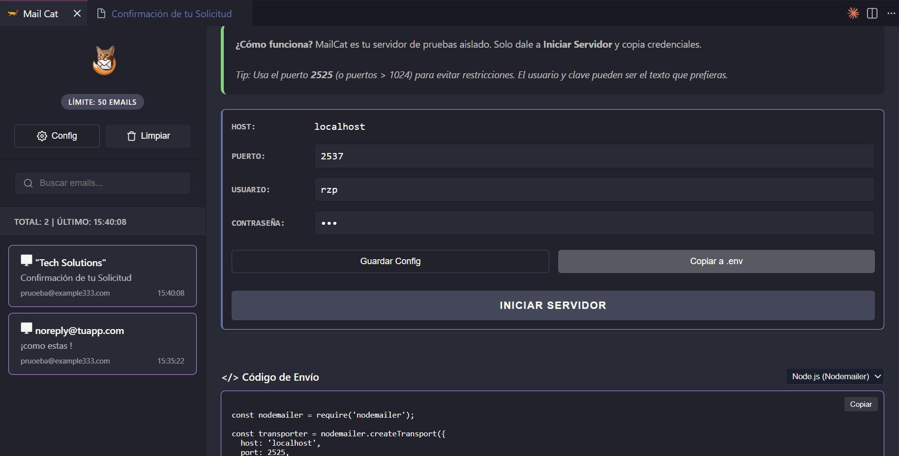

<div align="center">
  
  <div align="center">
  
 
</div>

 
  <h1>
    <span style="color: #FF8C42; font-weight: 700; letter-spacing: 0.5px; filter: drop-shadow(0 1px 3px rgba(255, 140, 66, 0.2));">MailCat</span> - Sandbox Local SMTP</h1>
  <p><em>La forma más fácil de capturar, visualizar y probar correos electrónicos directamente en VS Code.</em></p>
  
  [](https://marketplace.visualstudio.com/)
  [](LICENSE)
  [](#)
</div>

---

## Cómo Funciona MailCat


<div align="center">
  
</div>

**MailCat** es un servidor SMTP local ligero integrado directamente en VS Code. Tu aplicación envía correos a localhost, MailCat los captura y los muestra en una bandeja de entrada hermosamente diseñada.

* **No más correos en tu bandeja real**  
* **No más servicios SMTP pagos**  
* **Todo capturado localmente en tu máquina**

---
  <div align="center">
  
 
</div>

## Características Principales

- **Configuración Cero**: Funciona de inmediato en el puerto `2525`
- **Compatible Universal**: Funciona con **Node.js, PHP, Python, Java, C#, Go, Ruby, etc.**
- **Vista Previa en Vivo**: Ve exactamente cómo se renderizará tu correo
- **Dispositivos Responsivos**: Prueba en Desktop, Tablet y Mobile
- **Validación de Compatibilidad**: Detecta problemas CSS antes de enviar
- **Análisis Spam**: Verifica si tu correo será marcado como spam
- **Interfaz Profesional**: Toda la potencia en un panel lateral de VS Code

---

## Guía Rápida

### 1. Inicia el Servidor

Abre la paleta de comandos (`Ctrl+Shift+P` o `Cmd+Shift+P`) y escribe:
```
MailCat: Start Sandbox
```

### 2. Configura tu Backend

```env
SMTP_HOST=localhost
SMTP_PORT=2525
SMTP_USER=rzp
SMTP_PASS=rzp
```

#### Node.js (Nodemailer)
```javascript
const transporter = nodemailer.createTransport({
  host: 'localhost',
  port: 2525,
  auth: { user: 'rzp', pass: 'rzp' }
});

await transporter.sendMail({
  from: 'noreply@app.com',
  to: 'user@example.com',
  subject: 'Prueba MailCat',
  html: '<h1>Funciona!</h1>'
});
```

#### Python (smtplib)
```python
import smtplib
from email.mime.text import MIMEText

server = smtplib.SMTP('localhost', 2525)
server.login('rzp', 'rzp')

msg = MIMEText('<h1>Funciona!</h1>', 'html')
msg['Subject'] = 'Prueba MailCat'
msg['From'] = 'noreply@app.com'
msg['To'] = 'user@example.com'

server.send_message(msg)
server.quit()
```

#### PHP (Laravel)
```php
'mailers' => [
    'mailcat' => [
        'transport' => 'smtp',
        'host' => 'localhost',
        'port' => '2525',
        'username' => 'rzp',
        'password' => 'rzp',
    ],
],

Mail::mailer('mailcat')->send(new MyMail());
```

#### Java
```java
Properties props = new Properties();
props.put("mail.smtp.host", "localhost");
props.put("mail.smtp.port", "2525");
props.put("mail.smtp.auth", "true");

Session session = Session.getInstance(props, new Authenticator() {
    protected PasswordAuthentication getPasswordAuthentication() {
        return new PasswordAuthentication("rzp", "rzp");
    }
});

Message msg = new MimeMessage(session);
msg.setFrom(new InternetAddress("noreply@app.com"));
msg.setRecipients(Message.RecipientType.TO, InternetAddress.parse("user@example.com"));
msg.setSubject("Prueba MailCat");
msg.setText("¡Funciona!");
Transport.send(msg);
```

### 3. Ver y Analizar

Los correos aparecen en tiempo real en tu bandeja de entrada. Haz clic en cualquiera para ver:

<div align="center">
  
</div>

- **Vista Previa HTML**: Renderización exacta del correo
- **Validación Lint**: Problemas de compatibilidad CSS
- **Análisis Spam**: Puntuación y recomendaciones
- **Compatibilidad**: Soporte en Gmail, Outlook, Apple Mail, etc.
- **HTML Source**: Código fuente completo
- **Raw**: Información SMTP completa

<div align="center">
  
</div>

<div align="center">
  
</div>

<div align="center">
  
</div>

<div align="center">
  
</div>

---

## Pantalla Completa

<div align="center">
  
</div>

Abre cualquier correo en pantalla completa para una mejor visualización:

<div align="center">
  
</div>

- **Desktop, Tablet, Mobile**: Vistas optimizadas para cada dispositivo
- **Dark Mode**: Alterna entre modo claro y oscuro
- **Sin Distracciones**: Vista completa del correo

---

## Interface Principal

<div align="center">
  
</div>

**Características de la Interface:**
- Configuración SMTP editable
- Información del servidor en tiempo real
- Copiar credenciales al portapapeles
- Generación automática de .env
- Integración de snippets para 4+ lenguajes

---

## Comandos Disponibles

| Comando | Descripción |
|---------|-------------|
| `MailCat: Start Sandbox` | Inicia el servidor SMTP local |
| `MailCat: Stop Sandbox` | Detiene el servidor SMTP |
| `MailCat: Open Inbox in Tab` | Abre la bandeja de entrada en nueva pestaña |
| `MailCat: Copy SMTP Config` | Copia configuración al portapapeles |
| `MailCat: Clear Inbox` | Limpia todos los correos |

---

## Casos de Uso

* **Desarrollo Local**: Prueba notificaciones sin enviar correos reales  
* **Testing Automatizado**: Valida correos en tus tests  
* **Diseño de Plantillas**: Visualiza HTML en tiempo real  
* **Validación CSS**: Detecta problemas antes de producción  
* **Multi-Stack**: Funciona con cualquier lenguaje  

---

## Consejos Pro

- **Dark Mode**: Toggle de modo oscuro en pantalla completa
- **Device Preview**: Prueba en múltiples dispositivos
- **Spam Analysis**: Evita que tus correos caigan en spam
- **No Requiere Internet**: Todo funciona localmente
- **Límite de 50 emails**: En memoria, se limpian al reiniciar

---

## Instalación

1. Abre VS Code
2. Ve a Extensiones (`Ctrl+Shift+X`)
3. Busca "MailCat"
4. Haz clic en "Instalar"
5. ¡Listo! Comienza a usar MailCat

---

## Licencia

MIT - Libre para usar en proyectos personales y comerciales

---

<div align="center">
  <p style="font-size: 24px; margin: 20px 0;">❤️</p>
  
  <p><strong>Hecho con corazón para Desarrolladores</strong></p>
  <p><a href="https://github.com/RaulZ/email-extension-vscode/issues">Reportar un problema</a> · <a href="https://github.com/RaulZ/email-extension-vscode">Ver en GitHub</a></p>
</div>
